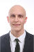
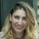
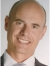

# Who are we?

We would like to say thank you to all people that contributed to this work since we believe that this tool will play a vital role in improving the design of mechanical structures. Here you can find information about everyone who provided a step forward towards the development of this method and code.

## Main authors

#### **Andrea Opreni**

He received the M.Sc. in materials engineering and nanotechnology from the Politecnico di Milano, Italy, in 2018, where he is currently pursuing a Ph.D. degree in Structural, Seismic, and Geotechnocal engineering at the Department of Civil and Environmental Engineering. His research focuses on numerical algorithms for nonlinear dynamic systems, with emphasis to dimensionality reduction tehcniques applied to continuum structures.

#### **Alessandra Vizzaccaro**

She received the M.Sc. in mechanical engineering from the Sapienza Università di Roma in 2015 and the Ph.D. in mechanical engineering from the Imperial College London in 2020. Her research focuses on analytical and numerical methods for vibrating structures. Special emphasis is dedicated to the development of direct parametrization of invariant manifold techniques for dimensionality reduction in continuum structures. 

#### **Attilio Frangi**

He received the M.Sc. degree in aeronautical engineering and the Ph.D. in structural engineering from the Politecnico di Milano, Italy, in 1994 and 1998, respectively. From 2001 to 2014, he was an Associate professor with the Department of Mechanics, Ecole Polytechnique, France. He is currently a Full professor with the Department of Civil and Environmental Engineering, Politecnico di Milano. He has authored more than 150 publications in the field of computational mechanics with a special focus on the simulation of multiphysics phenomena in microsystems. 

#### **Cyril Touzé** 

FILL WITH DEGREE AND PHD. He is currenlty full professor at the Institute of Mechanical Sciences and Industrial Applications (IMSIA). He has authored more than 120 publications in the vield of structural vibrations with special dedication to nonlinear dynamic phenomena in structures actuated at large displacements and dimensionlity reduction with normal form approaches. 

## Collaborators

#### **Loïc Salles**

He received the M.Sc. in mechanical engineering and the Ph.D. in computational mechanics from the Ecole Centrale de Lyon in 2006 and 2010, respectively. He is currently a Research Fellow in Rolls-Royce Vibration UTC in the Mechanical Engineering department. He joined Imperial College in 2012. His research focuses in nonlinear vibration and computational method for large scale modelling.

#### **Adrien Martin**

 FILL

